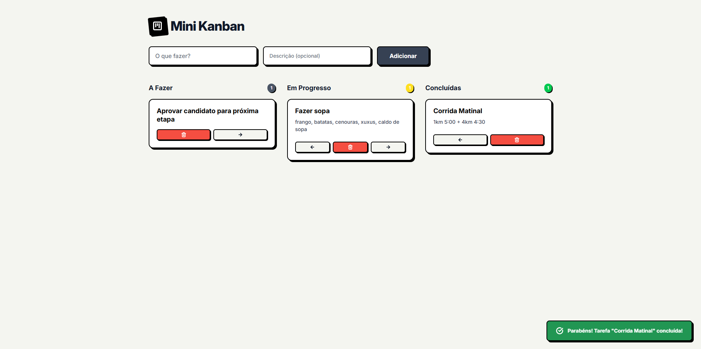
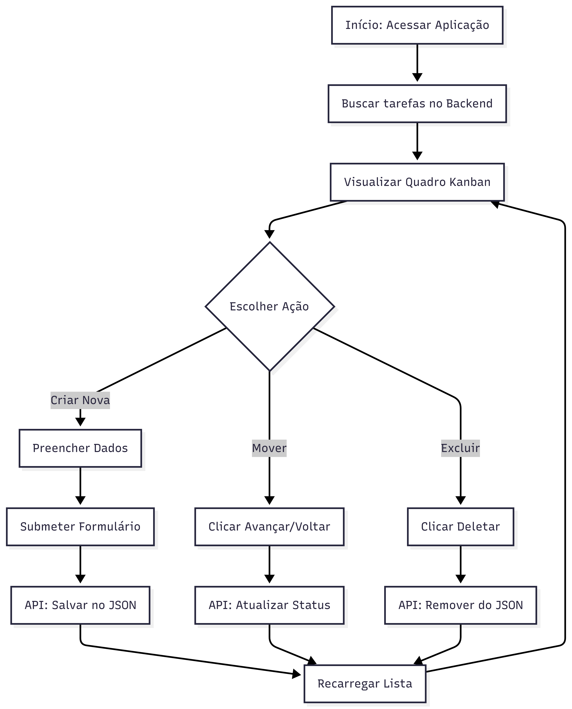
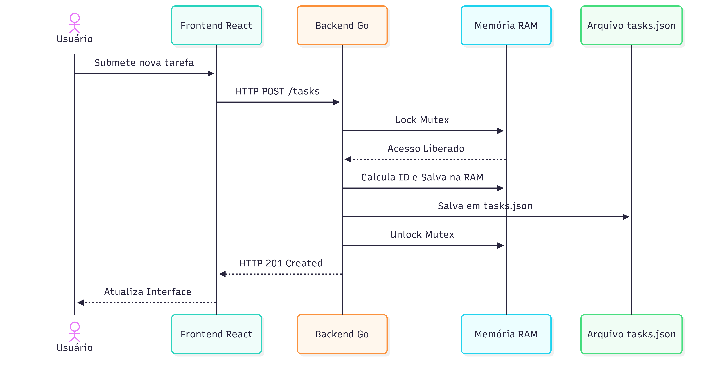

# Mini Kanban de Tarefas (React + Go)

Um sistema Kanban minimalista desenvolvido focando em simplicidade e código limpo.

## Executando o projeto

### 1. Rodando a API
1. Navegue até a pasta do backend: `cd backend`
2. Certifique-se de ter Golang(versão 1.22 usada) instalado.
3. Inicie o servidor: `go run .`
4. A API estará rodando em `http://localhost:8080`.

### 2. Rodando o Frontend
1. Em outro CMD, navegue até a pasta do frontend: `cd frontend`
2. Instale as dependências: `npm install`
3. Inicie o servidor de desenvolvimento: `npm run dev`
4. Acesse o programa no seu navegador `http://localhost:5173` e se divirta.

## Decisões Técnicas

*  Optei por utilizar apenas bibliotecas built-in, sem a necessidade de frameworks externos. Os dados são armazenados em `backend/tasks.json`.
*   **Design:** A interface usa bordas fortes, sombras sólidas, e um minimalismo inspirado no design do produto PostHog.

## Limitações
*   **Drag and Drop:** A movimentação das tasks atualmente acontece via botões, por ser mais acessível. A implementação de bibliotecas como `dnd-kit` traria uma fluidez maior.
*   **DB:** A atual persistência em JSON atende perfeitamente ao MVP. Para um cenário de produção escalável, a substituição por SQLite ou PostgreSQL seria o próximo passo.

## Documentação 

### User Flow

### Data Flow

